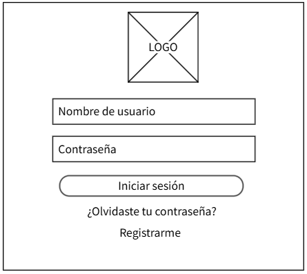
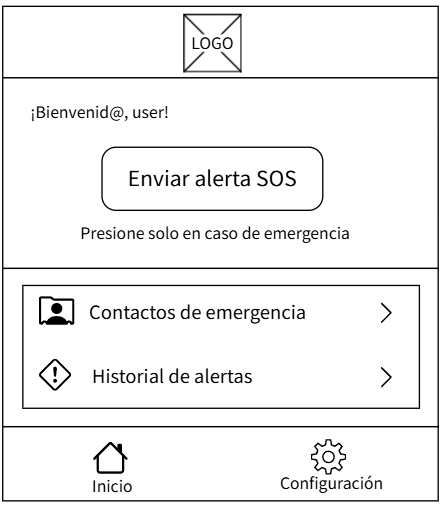
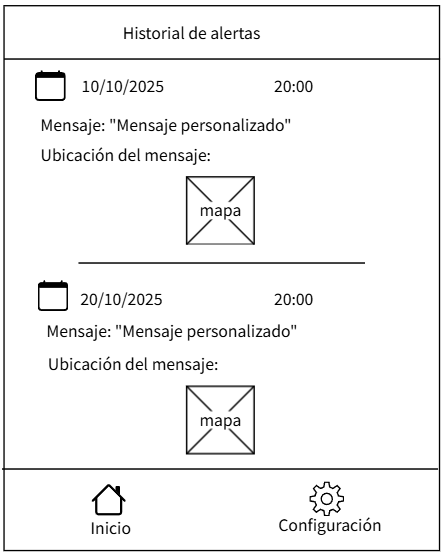
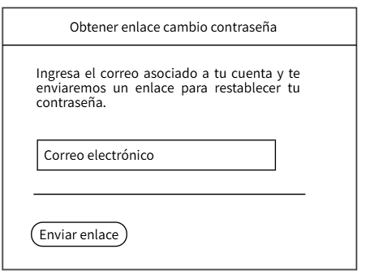
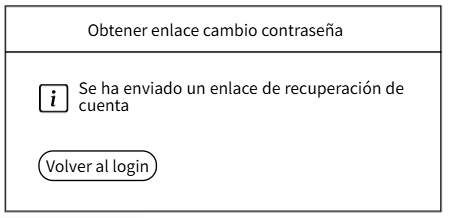
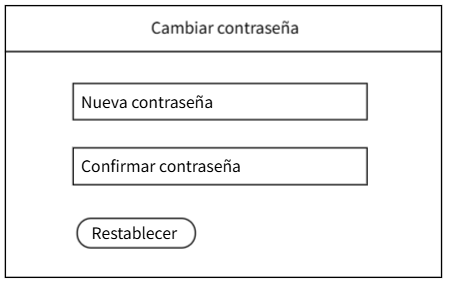

# SOS Puntarenas

### 👩‍💻 Autor
**Nombre:** Laura Montero Carvajal 
**Curso:** Desarrollo de Aplicaciones para Dispositivos Móviles
**Profesor:** Ever Barahona Mendoza
**Año:** 2025  

### Descripción general
SOS Puntarenas es una aplicación web móvil dedicada a garantizar la seguridad de las personas en la región.
Permite a los usuarios enviar una alerta de emergencia, junto con su ubicación en tiempo real, a sus contactos de confianza con solo un toque.
Está diseñada para ser intuitiva, rápida y de fácil acceso en cualquier momento.

---

### Funcionalidades principales
- Registro e inicio de sesión de usuarios.  
- Registro de contactos de emergencia.  
- Botón SOS que envía alerta con ubicación.  
- Historial de alertas enviadas.  
- Recuperación y cambio de contraseña.  

---

### Mockups de la Aplicación

> Los siguientes mockups muestran las pantallas principales de la app.  

#### Pantalla 1: Inicio de Sesión

#### Pantalla 2: Registro de Usuario

#### Pantalla 3: Menú Principal

#### Pantalla 4: Alerta SOS

#### Pantalla 5: Contactos de Emergencia

#### Pantalla 6: Historial de Alertas

#### Pantalla 7: Configuración

#### Pantalla 8: Obtener enlace de recuperación

#### Venatana emergente
Aparece luego de solicitar el enlace de recuperación de contraseña.

#### Pantalla 9: Cambiar Contraseña
La siguiente pantalla aparece al abrir el enlace que se recibició al correo luego de pedir el enlace de recuperación de contraseña o bien también aparece directamente luego de tocar el botón de "Cambiar contraseña" ubicado en la pantalla de configuración.

---

### Flujo general de la app
El flujo comienza con el registro o inicio de sesión, lo que lleva al menú principal. Desde ahí, se puede acceder a diversas opciones: al presionar el botón SOS, se envía una alerta y se guarda en el historial sección a la que se va a poder acceder desde la pantalla principal; en la sección de contactos, es posible agregar o editar personas; finalmente en configuración, se pueden cambiar o recuperar las contraseñas.